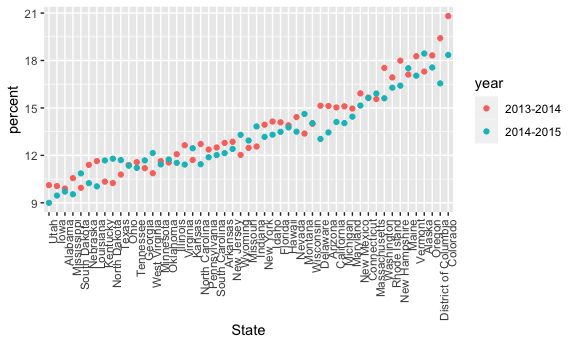
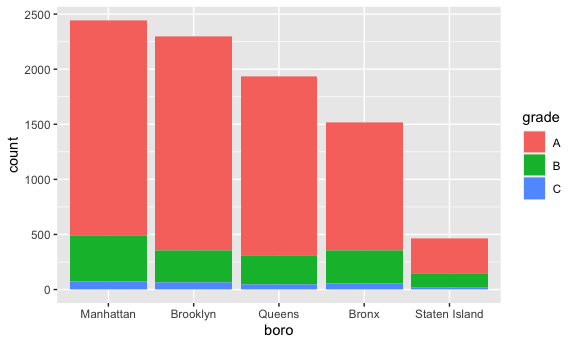
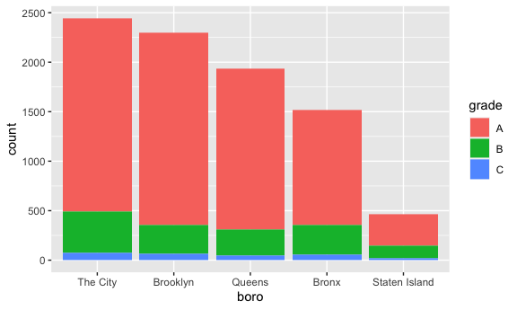

Strings and Factors
================

``` r
library(tidyverse)
```

    ## ── Attaching packages ─────────────────────────────────────── tidyverse 1.3.1 ──

    ## ✓ ggplot2 3.3.5     ✓ purrr   0.3.4
    ## ✓ tibble  3.1.4     ✓ dplyr   1.0.7
    ## ✓ tidyr   1.1.3     ✓ stringr 1.4.0
    ## ✓ readr   2.0.1     ✓ forcats 0.5.1

    ## ── Conflicts ────────────────────────────────────────── tidyverse_conflicts() ──
    ## x dplyr::filter() masks stats::filter()
    ## x dplyr::lag()    masks stats::lag()

``` r
library(rvest)
```

    ## 
    ## Attaching package: 'rvest'

    ## The following object is masked from 'package:readr':
    ## 
    ##     guess_encoding

``` r
library(p8105.datasets)

knitr::opts_chunk$set(
  fig.width = 6, 
  fig.asp = .6,
  out.width = "90%"
)
```

## String Vectors

Strings are case sensitive.

``` r
string_vec = c("my", "name", "is", "jeff")

str_detect(string_vec, "m")
```

    ## [1]  TRUE  TRUE FALSE FALSE

``` r
str_replace(string_vec, "jeff", "Jeff")
```

    ## [1] "my"   "name" "is"   "Jeff"

``` r
string_vec = c(
  "i think we all rule for participating",
  "i think i have been caught",
  "i think this will be quite fun actually",
  "it will be fun, i think"
  )

str_detect(string_vec, "^i think")
```

    ## [1]  TRUE  TRUE  TRUE FALSE

``` r
str_detect(string_vec, "i think$")
```

    ## [1] FALSE FALSE FALSE  TRUE

`^` indicates beginning of the line – looking for this pattern at the
beginning only `$` looks at end of line of string

``` r
string_vec = c(
  "Y'all remember Pres. HW Bush?",
  "I saw a green bush",
  "BBQ and Bushwalking at Molonglo Gorge",
  "BUSH -- LIVE IN CONCERT!!"
  )

str_detect(string_vec,"bush")
```

    ## [1] FALSE  TRUE FALSE FALSE

``` r
str_detect(string_vec,"[Bb]ush")
```

    ## [1]  TRUE  TRUE  TRUE FALSE

`[Bb]` gets upper and lower case bush, can also include a range of
values

``` r
string_vec = c(
  '7th inning stretch',
  '1st half soon to begin. Texas won the toss.',
  'she is 5 feet 4 inches tall',
  '3AM - cant sleep :('
  )

str_detect(string_vec, "^[0-9][a-zA-Z]")
```

    ## [1]  TRUE  TRUE FALSE  TRUE

``` r
string_vec = c(
  'Its 7:11 in the evening',
  'want to go to 7-11?',
  'my flight is AA711',
  'NetBios: scanning ip 203.167.114.66'
  )

str_detect(string_vec, "7.11")
```

    ## [1]  TRUE  TRUE FALSE  TRUE

This is looking for 7 followed by anything and then 11. `.` looks for
any character

``` r
string_vec = c(
  'The CI is [2, 5]',
  ':-]',
  ':-[',
  'I found the answer on pages [6-7]'
  )

str_detect(string_vec, "\\[")
```

    ## [1]  TRUE FALSE  TRUE  TRUE

Use double backslash `\\` for special characters like periods or
brackets

## Why factors are weird

``` r
factor_vec = factor(c("male", "male", "female", "female"))

as.numeric(factor_vec)
```

    ## [1] 2 2 1 1

``` r
factor_vec = fct_relevel(factor_vec, "male")
as.numeric(factor_vec)
```

    ## [1] 1 1 2 2

## NSDUH

``` r
nsduh_url = "http://samhda.s3-us-gov-west-1.amazonaws.com/s3fs-public/field-uploads/2k15StateFiles/NSDUHsaeShortTermCHG2015.htm"

table_marj = 
  read_html(nsduh_url) %>% 
  html_table() %>% 
  first() %>%
  slice(-1)
```

Let’s clean this up

``` r
marj_df = table_marj %>% 
  select(-contains("P Value")) %>% 
  pivot_longer(
    -State,
    names_to = "age_year",
    values_to = "percent"
  ) %>% 
  separate(age_year, into = c("age", "year"), "\\(") %>% 
  mutate(
    year = str_replace(year, "\\)", ""),
    percent = str_replace(percent, "[a-c]$", ""),
    percent = as.numeric(percent)
  ) %>% 
  filter(!(State %in% c("Total U.S.", "Midwest", "Northeast", "South", "West")))
```

Do dataframe stuff

``` r
marj_df %>%
  filter(age == "12-17") %>% 
  mutate(State = fct_reorder(State, percent)) %>% 
  ggplot(aes(x = State, y = percent, color = year)) + 
    geom_point() + 
    theme(axis.text.x = element_text(angle = 90, hjust = 1))
```



## Restaurant Inspections

``` r
data("rest_inspec")

rest_inspec %>% 
  group_by(boro, grade) %>% 
  summarize(n = n()) %>% 
  pivot_wider(names_from = grade, values_from = n)
```

    ## `summarise()` has grouped output by 'boro'. You can override using the `.groups` argument.

    ## # A tibble: 6 × 8
    ## # Groups:   boro [6]
    ##   boro              A     B     C `Not Yet Graded`     P     Z  `NA`
    ##   <chr>         <int> <int> <int>            <int> <int> <int> <int>
    ## 1 BRONX         13688  2801   701              200   163   351 16833
    ## 2 BROOKLYN      37449  6651  1684              702   416   977 51930
    ## 3 MANHATTAN     61608 10532  2689              765   508  1237 80615
    ## 4 Missing           4    NA    NA               NA    NA    NA    13
    ## 5 QUEENS        35952  6492  1593              604   331   913 45816
    ## 6 STATEN ISLAND  5215   933   207               85    47   149  6730

``` r
rest_inspec %>% 
  janitor::tabyl(boro, grade)
```

    ##           boro     A     B    C Not Yet Graded   P    Z   NA_
    ##          BRONX 13688  2801  701            200 163  351 16833
    ##       BROOKLYN 37449  6651 1684            702 416  977 51930
    ##      MANHATTAN 61608 10532 2689            765 508 1237 80615
    ##        Missing     4     0    0              0   0    0    13
    ##         QUEENS 35952  6492 1593            604 331  913 45816
    ##  STATEN ISLAND  5215   933  207             85  47  149  6730

``` r
rest_inspec =
  rest_inspec %>% 
  filter(
    str_detect(grade, "[ABC]"),
    !(boro == "Missing")
  ) %>% 
  mutate(boro = str_to_title(boro))
```

``` r
rest_inspec %>% 
  filter(str_detect(dba, "[Pp][Iz][Zz][Zz][Aa]")) %>% 
  mutate(
    boro = fct_infreq(boro)
  ) %>% 
  ggplot(aes(x = boro, fill = grade)) +
  geom_bar()
```



What about changing factor labels…

``` r
rest_inspec %>% 
  filter(str_detect(dba, "[Pp][Iz][Zz][Zz][Aa]")) %>% 
  mutate(
    boro = fct_infreq(boro),
    boro = fct_recode(boro, "The City" = "Manhattan")
  ) %>% 
  ggplot(aes(x = boro, fill = grade)) +
  geom_bar()
```


`str_replace` changed factor back to string
